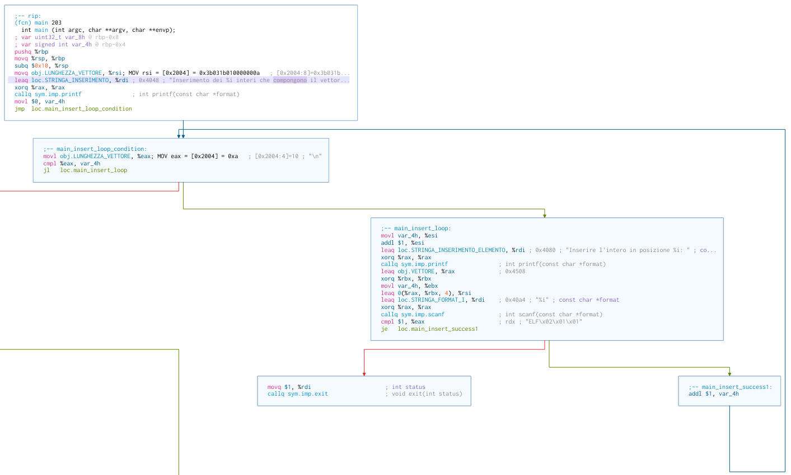
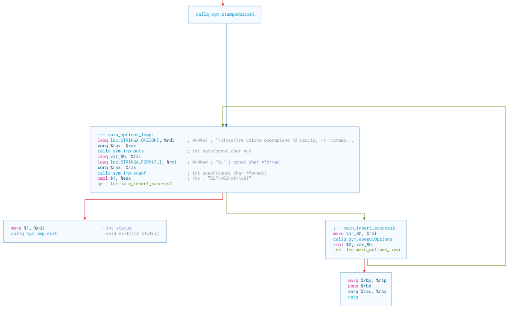
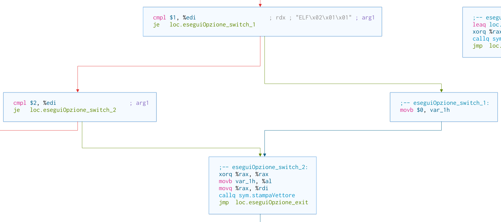
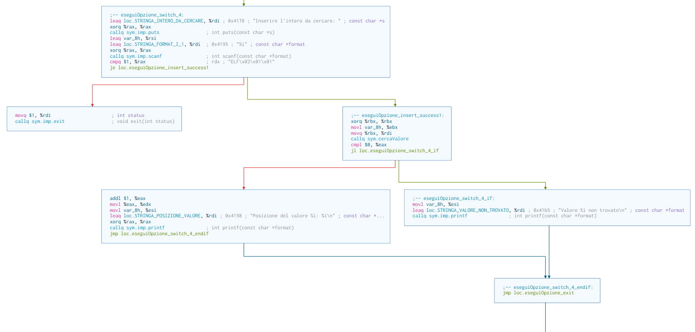
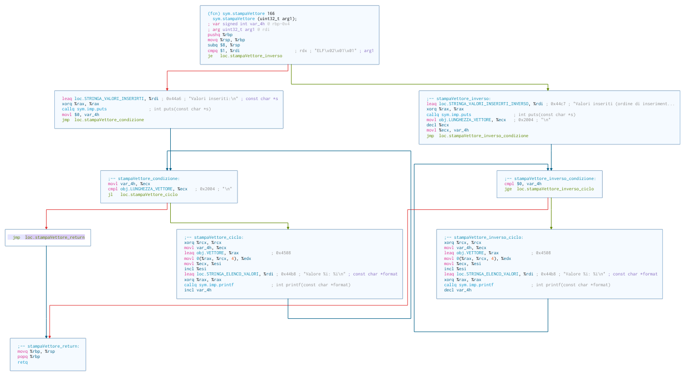
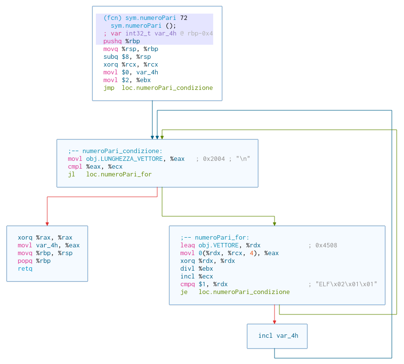
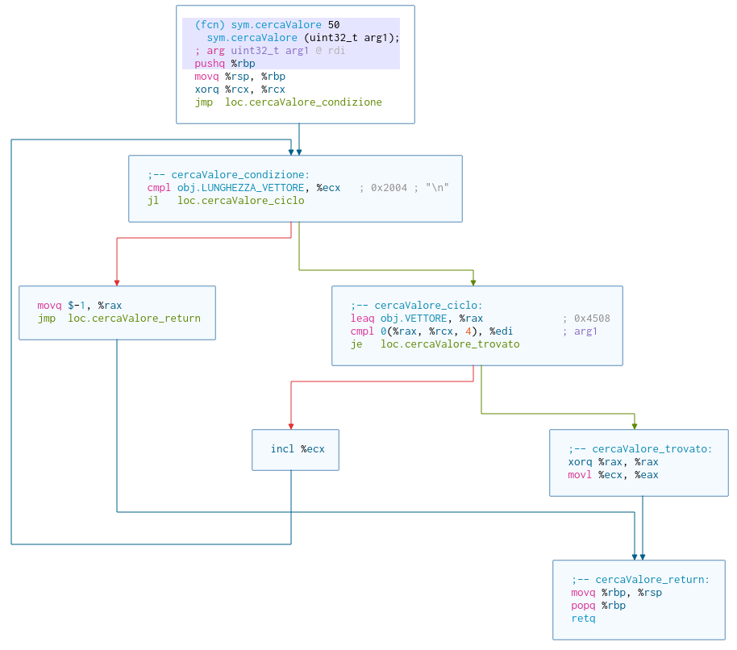
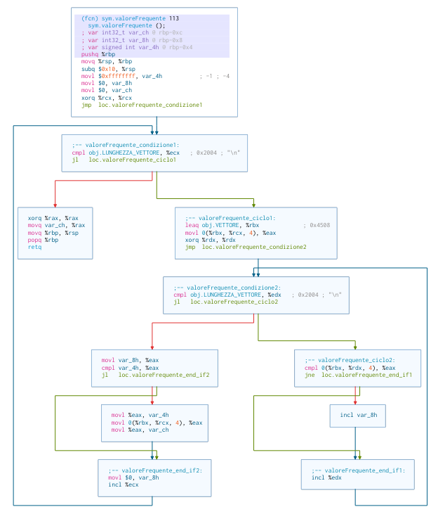
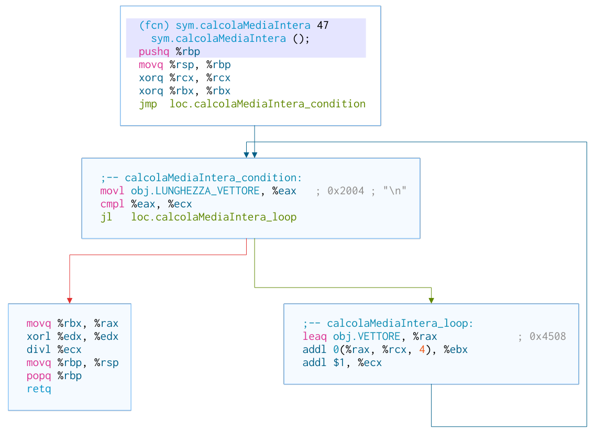

# Elaborato Assembly

[TOC]

## Introduzione

Il programma utilizza diverse funzioni per eseguire operazioni tra cui il calcolo del massimo e della media, la ricerca dei numeri pari e il valore più frequente. Inoltre, il programma permette di cercare valori, eseguire opzioni e stamparle. In più una funzione consente di gestire i vettori.

## Variabili

Per questo progetto, dopo aver esaminato attentamente il file di programmazione fornitoci e le relative
funzioni al suo interno, abbiamo deciso di implementare i numeri che andranno a comporre il vettore
come variali globali, dato che queste ultime non verranno modificate dalle suddette funzioni, inoltre grazie
a ciò siamo riusciti a rendere più agevole la realizzazione delle successive funzioni.
Nel file main dopo l'inserimento della lunghezza del vettore e dei suoi componenti, ci verrà chiesto se si
vuole eseguire una delle 10 funzioni presenti all'interno del programma, se non si vorrà eseguire nessuna
opzione basterà inserire in input il valore zero altrimenti si dovrà inserire 1.
Fatto ciò il file main richiamerà il file di stampaOpzioni il quale mostrerà all'utente un interfaccia in cui
ci saranno scritte tutte le funzioni affiancate al relativo numero da digitare per la loro scelta.
Dopo la scelta della funzione il file main farà una cal al file eseguiOpzioni, nel quale utilizzando il dato
precedentemente preso nel file stampaOpzioni e salvato nel registro %EAX o %rax (in base alla versione
di utilizzo), utilizzerà una struttura case-switch, per richiamare il file di cui si ha bisogno per la
realizzazione dell’operazione richiesta dall'utente.
Per ogni operazione è stato creato un file apposito nel quale, il risultato verrà salvato nel registro %EAX o
%rax per poi poter essere passato al file eseguiOpzione che si occuperà di stamparne a video il risultato,
dopo la stampa sarà presente un jump che porterà alla chiusura del suddetto file, per tornare nel main nel
quale come detto precedentemente inserendo il valore 1 si potrà scegliere una nuova opzione, altrimenti
se si inserirà 0, ciò porterà alla fine dell’esecuzione del programma.

## Argomenti e return delle funzioni

Il progetto e diviso a 32 e a 64 bit e quindi richiede due tipi di passaggio dei valori alle funzioni. In tutti e due i casi pero il valore di ritorno sarà inserito nel registro **EAX/RAX\***.

### Utilizzo Registri

A 64 bit le funzioni di C e del programma permettono l'utilizzo dei registi per il passaggio dei parametri alle funzioni. SI utilizza i parametri nel seguente ordine:

1. **RDI**
2. **RSI**
3. **RDX**
4. **RCX**
5. ...

### Stack

A 32 bit i parametri vengono pushiati sulla stack in ordine inverso. Ad esempio per uno scanf

```assembly
...
push    $valore2
push    $valore1
push    $format
call    scanf
...
```

Mentre in C sarebbe

```c
...
scanf("%i %i", valore1, valore2);
...
```

## Codice

Il codice è formato da 12 diverse funzioni.

### Main

La funzione main è divisa in due parti importanti:

1. L'inserimento dell'array
2. La scelta delle opzioni

#### Inserimento dell'array



Durante l'inserimento viene stampata la stringa con il numero totale di elementi da inserire. Successivamente si entra in un **ciclo for** chi inserisce gli elementi nell'array. Dentro al ciclo for c'è un controllo sul valore ritornato da **scanf** che se non è uguale a 1 esce dal programma con un codice di errore.

#### Scelta opzione



Nella scelta opzione prima viene stampato il menu, poi si entra in un **wile loop** fino a che l'opzione non è zero cioè l'opzione di uscita a quel punto ritorna 0. Se c'è un errore nello scanf ancora il programma esce ritornando un codice di errore. Invece se non ci sono errori il programma chiama la funzione **eseguiOpzione** con parametro il valore inserito.

### Stampa opzioni

Consiste in un singolo blocco di codice per stampare il menu delle opzioni.

### Esegui opzione

La funzione riceve come parametro un int per le opzioni che viene passato a uno **switch case** costituito da una serie di compare e jumps.

```assembly
    cmp     $0, %edi
    // Case uscita dall'operazione
    je      eseguiOpzione_switch_0
    cmp     $1, %edi
    // Case stampa VETTORE
    je      eseguiOpzione_switch_1
    cmp     $2, %edi
    // Case stampa VETTORE iverso
    je      eseguiOpzione_switch_2
    cmp     $3, %edi
    // Case stampa numeri pari e dispari
    je      eseguiOpzione_switch_3
    cmp     $4, %edi
    // Case cerca valore in VETTORE
    je      eseguiOpzione_switch_4
    cmp     $5, %edi
    // Case valore massimo
    je      eseguiOpzione_switch_5
    cmp     $6, %edi
    // Case posizione massimo
    je      eseguiOpzione_switch_6
    cmp     $7, %edi
    // Case valore minimo
    je      eseguiOpzione_switch_7
    cmp     $8, %edi
    // Case posizione minimo
    je      eseguiOpzione_switch_8
    cmp     $9, %edi
    // Case valore più frequente
    je      eseguiOpzione_switch_9
    cmp     $10, %edi
    // Case media intera
    je      eseguiOpzione_switch_10
    cmp     $-1, %edi
    // Case stampa opzioni
    je      eseguiOpzione_switch_m1
    // Default case opzione non supportata
    jmp     eseguiOpzione_switch_default
```

#### Case 0

Stampa la stampa la stringa di uscita e ritorna

```pseudocode
case 0:
    puts "Usita dall'applicazione...";
    return;
...
```

#### Case 1 e 2

I case 1 e 2 servono a stampare l'array in ordine o inverso. All'inizio della funzione settiamo a true una variabile booleana **stampaOrdineInverso**. Se il case è 1 il programma resetta stampaOrdineInverso a false e continuerà con il case 2 chiamando la funzione **stampaVettore** passando come argomento la variabile booleana.

```pseudocode
set stampaOrdineInverso true;
...
case 1:
    set stampaOrdineInverso false;
case 2:
    stampaVettore stampaOrdineInverso;
    return;
```



#### Case 4

Nel case 4 riceve in input il numero da cercare e se da errore esce dal programma. Dopo chiama la funzione **cercaValore** e se questa ritorna un numero maggiore o uguale a 0, stampa a video il numero che è la posizione del valore. Se invece il numero è minore di zero, stampa _"Valore non trovato"_.



#### Altri casi

In tutti gli altri casi viene chiamata la corrispettiva funzione, mentre se l'opzione non esiste viene stampato a video _"Opzione non supportata dall'applicazione!"_

### Stampa Vettore

La funzione riceve come parametro una variabile booleana per stampare in ordine diretto o inverso. Pertanto in **stampaVettore** vi sono due cicli principali divisi da un blocco di if : uno per la stampa diretta con indice da 0 a **LUNGHEZZA_VETTORE** e uno inverso da **LUNGHEZZA_VETTORE** a 0.



### Numero pari

La funzione numero pari ritorna il numero di elementi pari contenuti in **VETTORE**, ed è costituita da un unico ciclo for con un if all'interno che controlla se un valore è pari e se lo è incrementa un variabile contatore per poi alla fine ritornarla.



### Cerca valore

La funzione **cercaValore** riceve come parametro un valore da cercare nell'array. Come struttura è molto simile a **numeriPari** in quanto è costituita da un ciclo for con un if all'interno che controlla se un valore di **VETTORE** è uguale al parametro passato alla funzione e se cosi fosse ne ritorna la posizione. Se il parametro non è contenuto, la funzione ritorna -1.



### Calcola Max/Min

Le due funzioni sono costituite da un ciclo for contenente un if che controlla il valore massimo/minimo siano minori dei valori dell'array.

```pseudocode
int calcoloMax/calcoloMin (void) {
    set max/min VETTORE[0];
    for val in VETTORE {
        if val > or < max/min {
            set max/min val;
        }
    }
    return max/min;
}
```

### Posizione Max/Min

Le due funzioni chiamano i corrispettivi **calcolaMax/calcolaMin** e passano il valore ritornato alla funzione **cercaValore** cosi da ritornare la posizione del Max/Min.

```pseudocode
int posizioneMax/posizioneMin (void) {
    set max/min calcoloMax()/calcoloMin();
    return cercaValore(max/min);
}
```

### Valore frequente

La funzione **valoreFrequnete** è costituita da due cicli for e due if. I cicli scorrono tutti i valori dei due array. Il primo if controlla un valore dell'array con tutti gli alti e se sono uguali incrementa il contatore della frequenza. Il secondo if controlla se la frequenza è maggiore della frequenza massima, settata a -1 all'inizio della funzione, e se la frequenza è maggiore setta un nuova frequenza massima e valore più frequente.

```pseudocode
int valoreFrequente (void) {
    set maxFreq -1;
    set freq 0;
    set valoreFreq 0;
    for var1 in VETTORE {
        for var2 in VETTORE {
            if var1 == var2 {
                set freq  freq+1 ;
            }
        }
        if freq > maxFreq {
            set maxFreq freq;
            set valoreFreq var1;
        }
        set freq 0;
    }
    return valoreFreq;
}
```



### Calcola media

La funzione **calcolaMedia** è una funzione semplice che itera gli elementi di **VETTORE**, li somma e divide la somma per il suo numero di elementi cosi da calcolare la media.



## Scelte progettuali

Il progetto e stato fatto in due modi diversi: il primo a 32 bit e il secondo a 64 bit. Tutte le funzioni con i rispettivi dati sono state divise in rispettivi fiele, mentre le variabili globali sono state inserite in un unico file chiamato **data.s**. Per compilare l'intero progetto sono statti provvisti due metodi: **Makefile** e **Cmake**.

A 32 bit l'indirizzamento è stato diretto, mente a 64 indiretto tramite l'utilizzo del **instruction pointer**. Le funzioni provenienti dal **C** sono usate utilizzate relative al **PLT** (procedure linkage table) .

Abbiamo utilizzato Make per questioni di compatibilità con i programmi della scuola, ma in sviluppo abbiamo utilizzato Cmake per le funzioni in più.

Per testare come funzione in più abbiamo utilizzato il framework gtest e per lavorare in gruppo il CVS Gitlab.

### Cmake & Test

Cmake ci permette di compilare i file come una libreria a se stante per poterlo testare con gtest. Questa libreria contiene tutte le funzioni e le variabili globali e verrà ricompilata assieme al main per avere un eseguibile completo.
